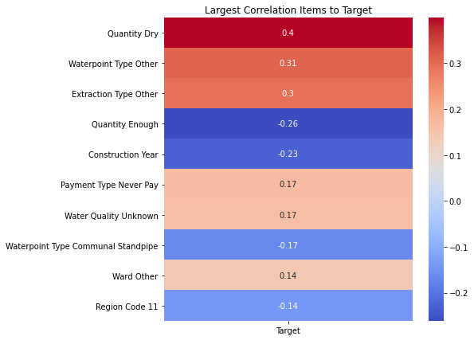
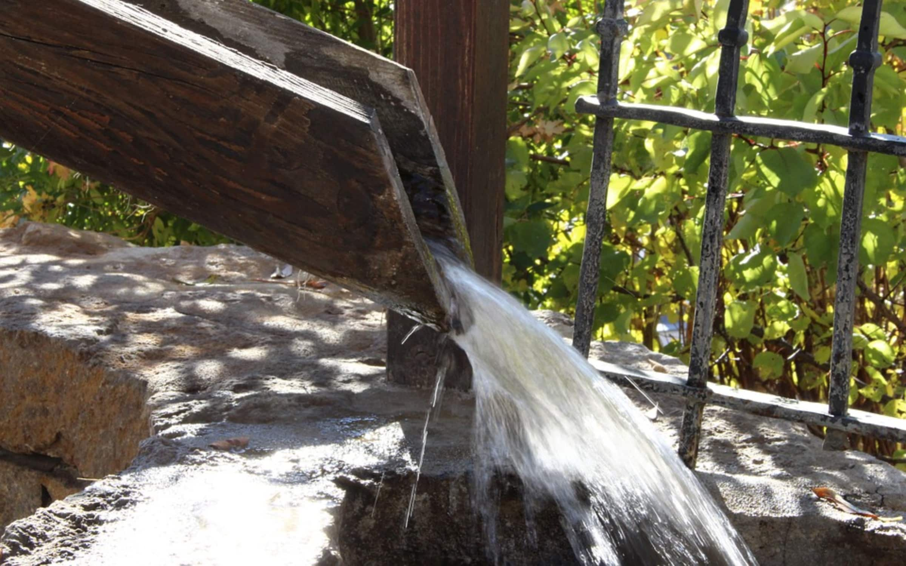

# Phase_3_Project
# Tanzanian Water Pipe Predictions

### Overview
In this project, I was challenged to develop predictive models capable of determining the status of water pumps in Tanzania. There were three distinct classes that I needed to predict: functional, functional-needs-repair, and non-functional. By using an iterative process of adjusting features, sampling techniques, and hyper-parameters, I endeavored to find the most accurate predictive model.
### Data Understanding
I gained access to data from the Tanzanian Ministry of Water and a business named Taarifa. The data contained 59400 rows of data with 40 feature columns and 1 target column. There were both numeric and categorical columns in the data, and some of the apparently numeric columns also represented categorical information. Furthermore, several of the columns contained redundant information from other columns. In those cases, I choose the columns with more granular data that contained more useable details for my models to utilize in their construction. There were also several columns that required binning of values because the number of unique items within the column were voluminous, and would both provide superfluous specificity and also cost computational power. After I selected the feature columns I found to be most relevant for model construction, I began record data from baseline models. I also built iterative sklearn pipelines that allowed for quick and easy modification of my models' hyperparameters.

### Evaluation
I transformed the data into a new dataframe containing over 960 features. I then looked at correlations of features to the target classes, various performance metrics, and utilized as much data as I could. This was a slow, iterative process, wherein I attempted to adjust model hyper-parameters as well as feature selections and interactions.

### Conclusion
The best performing model predicted unseen data accurately at a rate of roughly 76%. It was extremely difficult to affect any kind of positive change on the performance of the Logistic Regression models. That being said, the best model suprassed baseline performance by over 20 basis points.  

I would advise giving extra consideration to older pumps, and also for conditions where the "quantity" is dry. These two factors are relatively well tracked, and provide strong predictive guidance.

Finally, it is important to remember that when people's access to water is at stake, we should utilize any predictive advantage at our disposal. The model that I have constructed can help you predict malfunctions and maintain water pumps, thereby providing access to water for Tanzania's citizens, people who are in need.

